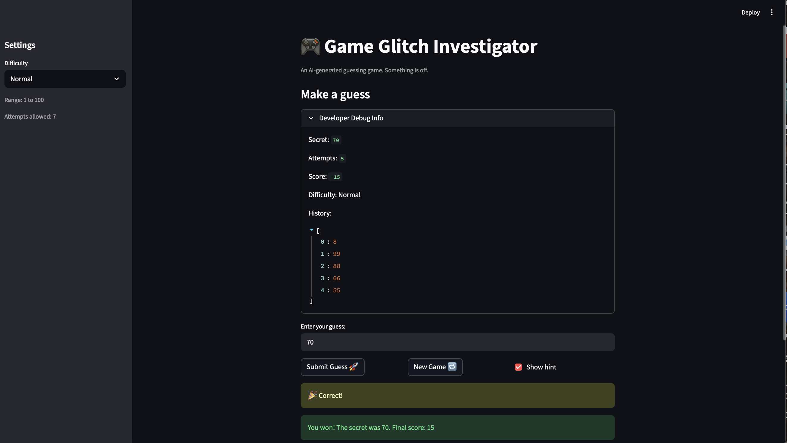

# 🎮 Game Glitch Investigator: The Impossible Guesser

## 🚨 The Situation

You asked an AI to build a simple "Number Guessing Game" using Streamlit.
It wrote the code, ran away, and now the game is unplayable. 

- You can't win.
- The hints lie to you.
- The secret number seems to have commitment issues.

## 🛠️ Setup

1. Install dependencies: `pip install -r requirements.txt`
2. Run the broken app: `python -m streamlit run app.py`

## 🕵️‍♂️ Your Mission

1. **Play the game.** Open the "Developer Debug Info" tab in the app to see the secret number. Try to win.
2. **Find the State Bug.** Why does the secret number change every time you click "Submit"? Ask ChatGPT: *"How do I keep a variable from resetting in Streamlit when I click a button?"*
3. **Fix the Logic.** The hints ("Higher/Lower") are wrong. Fix them.
4. **Refactor & Test.** - Move the logic into `logic_utils.py`.
   - Run `pytest` in your terminal.
   - Keep fixing until all tests pass!

## 📝 Document Your Experience

- [ ] The purpose of this game is to prompt the user to guess a secret number, 
which they can attempt to find multiple times in each game. Depending on the
difficulty, the user will have more or less guesses. If they choose to have
hints on, they can see if they need to guess higher or lower; otherwise, they
will have to rely on pure guesswork to find the secret number within the amount
of attempts alotted.

- [ ] The following bugs were found and addressed: 
   - The user could make out-of-bound guesses
   - Hints were inverted (Too High -> Go HIGHER, Too Low -> Go LOWER)
   - Could not start a new game after game 1
   - Empty submissions cost an attempt
   - Functions imported to test_game_logic.py were in app.py instead of logic_utils.py

- [ ] The following fixes were applied:
   - Added an if-statement to check whether guesses were in-bounds or not
   - Changed the strings for the hints for too high and too low guesses to give
   proper guidance
   - Added a session_state.status called "playing" to evaluate whether the user
   is playing a new game or not; in turn, if status is "won", a new game can 
   start, rather than the user being trapped in one game the whole time
   - Added a condition in the parse_guess function to account for empty strings
   - Moved relevant functions from app.py to logic_utils.py so
   test_game_logic.py had access to the functions it was importing from logic_utils.py

## 📸 Demo

-  
